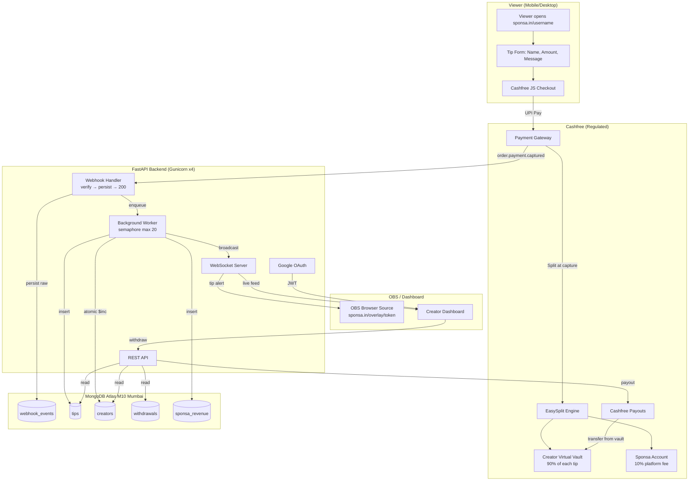

# Sponsa MVP — Implementation Plan (PRD v1.0)

> Restructured backend architecture based on the PRD. Replaces the original 6-phase plan with a Cashfree + Google OAuth + WebSocket architecture designed for live-stream concurrency.

---

## Summary of Changes from Original Plan

| Dimension | Original Plan (Phases 1-6) | PRD v1.0 |
|-----------|---------------------------|----------|
| **Payment Gateway** | Razorpay + Razorpay X Payouts | Cashfree PG + EasySplit + Cashfree Payouts |
| **Settlement Model** | Merchant-holds-all → manual payout | Split-at-ingestion via EasySplit (RBI compliant) |
| **Authentication** | Clerk (email + invite) | Google OAuth via Authlib (direct, no waitlist) |
| **Onboarding** | Waitlist → Admin approve → Clerk invite | Google Sign-In → Input UPI → Go Live |
| **Real-time** | Not addressed | WebSocket fan-out for OBS overlay (<2s) |
| **Data Retention** | TTL auto-delete tips after 72h | Permanent retention (regulatory) |
| **Terminology** | "Donation" / "Tip" | "Digital Interaction Fee" (FCRA safe) |
| **Wallet Model** | IOU in Sponsa's Razorpay balance | Cashfree virtual vault (never in Sponsa's account) |

---

## User Review Required

> [!IMPORTANT]
> **Cashfree EasySplit requires vendor KYC for each creator.** Individual creators need PAN + address proof (Aadhaar/DL/Passport). This adds onboarding friction vs. the original "just enter your UPI" model. The plan below accounts for this, but please confirm you're okay with requiring creator KYC during onboarding.

> [!WARNING]
> **EasySplit must be enabled by Cashfree.** It's not self-serve — you need to contact your Cashfree account manager or fill out their activation form. This should be initiated immediately as it can take 2-5 business days.

---

## Open Questions

> [!IMPORTANT]
> **Q1: Creator KYC scope.** The PRD says "Input Beneficiary UPI ID / KYC" during onboarding. With EasySplit, Cashfree requires at minimum PAN + address proof per vendor. Should we:
> - (A) Collect PAN + Aadhaar in-app and submit via API? (more friction, fully automated)
> - (B) Collect UPI only in-app, and do KYC manually via Cashfree dashboard for early creators? (less friction for MVP, doesn't scale)

> [!IMPORTANT]
> **Q2: Split timing.** Cashfree supports two split modes:
> - **Static split at order creation** — split percentages declared upfront when the order is created. Simpler.
> - **Split after payment** — split triggered 2+ minutes after payment captured. More flexible (you could vary the fee per creator).
> For MVP with a flat 10% fee, I recommend **static split at order creation**. Confirm?

> [!IMPORTANT]
> **Q3: WebSocket auth for OBS overlay.** The PRD mentions an "OBS Token." I propose a simple approach: generate a random, long-lived token per creator stored in the DB. The OBS URL would be `sponsa.in/overlay/{token}`. The token authenticates the WebSocket connection. No login required in OBS. Sound good?

> [!IMPORTANT]
> **Q4: Frontend framework.** The current frontend is React + Vite + TailwindCSS + shadcn/ui. The PRD doesn't change this. Should I keep the existing frontend stack, or do you want to migrate to Next.js for SSR (useful for SEO on the public tipping page)?

---

## Proposed Changes

### Phase A — Backend Scaffold & Configuration

This replaces the original Phase 3. Sets up the FastAPI project structure, database connection, and configuration for Cashfree instead of Razorpay.

#### [NEW] Server project structure

```
server/
├── main.py                 # FastAPI entry point + lifespan
├── config.py               # Pydantic Settings (Cashfree, Google, MongoDB)
├── db.py                   # Motor/Beanie connection
├── models/
│   ├── __init__.py
│   ├── creator.py          # Creator document (replaces waitlist+creator)
│   ├── tip.py              # Tip document (no TTL)
│   ├── withdrawal.py       # Withdrawal document
│   ├── revenue.py          # SponSa revenue document
│   └── webhook_event.py    # Raw webhook audit log (NEW)
├── routes/
│   ├── __init__.py
│   ├── auth.py             # Google OAuth login/callback + JWT
│   ├── creator.py          # Creator profile CRUD
│   ├── tip.py              # Order creation for viewers
│   ├── wallet.py           # Balance, tip feed, withdrawals
│   ├── overlay.py          # OBS WebSocket endpoint
│   └── webhooks/
│       └── cashfree.py     # Cashfree webhook handler
├── services/
│   ├── cashfree.py         # Async Cashfree API client (httpx)
│   ├── tip_processor.py    # Background tip processing logic
│   └── ws_manager.py       # WebSocket connection manager
├── lib/
│   ├── security.py         # HMAC verification, input sanitization
│   └── jwt.py              # JWT creation/validation
├── requirements.txt
├── Dockerfile
├── Procfile
└── .env.example
```

#### [NEW] `server/config.py`

Pydantic Settings covering all service credentials:

```python
class Settings(BaseSettings):
    # MongoDB
    mongodb_uri: str
    mongodb_db_name: str = "sponsa_dev"

    # Server
    port: int = 8000
    frontend_url: str = "http://localhost:5173"
    jwt_secret: str          # For signing session JWTs
    jwt_algorithm: str = "HS256"

    # Google OAuth
    google_client_id: str
    google_client_secret: str
    google_redirect_uri: str = "http://localhost:8000/api/auth/callback"

    # Cashfree
    cashfree_client_id: str
    cashfree_client_secret: str
    cashfree_webhook_secret: str
    cashfree_api_version: str = "2025-01-01"
    cashfree_base_url: str = "https://sandbox.cashfree.com/pg"  # swap for prod

    # Cashfree Payouts
    cashfree_payout_client_id: str = ""
    cashfree_payout_client_secret: str = ""
    cashfree_payout_base_url: str = "https://payout-gamma.cashfree.com/payout"
```

#### [NEW] `server/models/webhook_event.py`

Audit log for all inbound webhooks (from the concurrency analysis):

```python
class WebhookEvent(Document):
    source: str                       # "cashfree"
    event_type: str                   # "order.payment.captured"
    cashfree_payment_id: Indexed(str) # dedup key
    payload: dict                     # raw event body
    status: str = "pending"           # pending → processing → done → failed
    attempts: int = 0
    last_error: Optional[str] = None
    received_at: datetime
    processed_at: Optional[datetime] = None

    class Settings:
        name = "webhook_events"
        indexes = [
            [("status", 1), ("received_at", 1)],
            [("cashfree_payment_id", 1)],
        ]
```

#### [MODIFY] `server/models/tip.py`

Remove TTL index and `expires_at` field. Add `visible_until` for dashboard soft-filtering:

```python
class Tip(Document):
    creator_id: Indexed(PydanticObjectId)
    donor_name: str = Field(max_length=30)        # PRD: 30 char max
    message: Optional[str] = Field(default=None, max_length=150)  # PRD: 150 char max
    amount: Decimal
    creator_share: Decimal
    sponsa_fee: Decimal
    cashfree_payment_id: Indexed(str, unique=True) # idempotency
    cashfree_order_id: str
    timestamp: datetime = Field(default_factory=datetime.utcnow)
    # No TTL — permanent retention per PRD §6.2

    class Settings:
        name = "tips"
        indexes = [
            [("creator_id", 1), ("timestamp", -1)],
        ]
```

#### [MODIFY] `server/models/creator.py`

Replace Clerk fields with Google OAuth fields. Add OBS token and Cashfree vendor ID:

```python
class Creator(Document):
    google_id: Indexed(str, unique=True)
    email: Indexed(EmailStr, unique=True)
    slug: Indexed(str, unique=True)
    display_name: str
    avatar_url: Optional[str] = None
    youtube_url: Optional[str] = None

    # Cashfree EasySplit
    cashfree_vendor_id: Optional[str] = None    # set after vendor onboarding
    upi_id: Optional[str] = None
    upi_verified: bool = False

    # Wallet (internal ledger — mirrors Cashfree vault)
    wallet_balance: Decimal = Decimal("0.00")

    # OBS overlay
    obs_token: Indexed(str, unique=True)        # random token for WS auth

    created_at: datetime = Field(default_factory=datetime.utcnow)
    updated_at: datetime = Field(default_factory=datetime.utcnow)

    class Settings:
        name = "creators"
```

---

## Proposed Changes

### Phase B — Google OAuth Authentication

This replaces the original Phase 4 (Clerk + Waitlist). No waitlist, no admin approval — creators sign in with Google and are immediately onboarded.

#### [NEW] `server/routes/auth.py`

Google OAuth flow using Authlib:

- `GET /api/auth/google` — Redirects to Google consent screen
- `GET /api/auth/callback` — Handles OAuth callback, creates/finds creator doc, returns JWT
- `GET /api/auth/me` — Returns current creator profile from JWT

On first login:
1. Extract `google_id`, `email`, `name`, `picture` from Google ID token
2. Generate a URL-safe slug from the creator's name (with collision handling)
3. Generate a random `obs_token` (32-char hex)
4. Insert creator document
5. Return a signed JWT (HttpOnly cookie) to the frontend

**Dependencies:** `authlib`, `httpx`, `pyjwt`

#### [MODIFY] `src/main.tsx` (Frontend)

Replace `ClerkProvider` with a simple auth context that:
- Redirects to `/api/auth/google` for login
- Stores JWT in HttpOnly cookie (set by backend)
- Protects `/dashboard/*` routes client-side

---

### Phase C — Cashfree Payment Integration

This replaces the original Phase 5 (Razorpay). The fundamental change is using **EasySplit** for RBI-compliant split settlements instead of holding all funds in Sponsa's account.

#### [NEW] `server/services/cashfree.py`

Async Cashfree client using `httpx` (never the sync SDK):

```python
class CashfreeClient:
    """Async wrapper for Cashfree PG + EasySplit + Payouts APIs."""

    def __init__(self, settings: Settings):
        self.client = httpx.AsyncClient(
            timeout=5.0,
            headers={
                "x-client-id": settings.cashfree_client_id,
                "x-client-secret": settings.cashfree_client_secret,
                "x-api-version": settings.cashfree_api_version,
                "Content-Type": "application/json",
            },
        )
        self.base_url = settings.cashfree_base_url

    async def create_order(self, order_id, amount, customer_name, vendor_id, split_pct):
        """Create a Cashfree order with EasySplit vendor_splits."""
        ...

    async def create_vendor(self, vendor_id, name, email, upi_vpa, kyc_details):
        """Register a creator as an EasySplit vendor."""
        ...

    async def initiate_payout(self, vendor_id, amount, upi_vpa, transfer_id):
        """Instant UPI payout via Cashfree Payouts."""
        ...
```

#### [NEW] `server/routes/tip.py`

- `POST /api/tip/create-order` — Public endpoint (no auth required)
  1. Find creator by slug
  2. Validate amount (₹10–₹50,000), sanitize donor name & message
  3. Create Cashfree order with `vendor_splits` declaring 90% to creator's `cashfree_vendor_id`
  4. Return `order_id`, `payment_session_id` to frontend for Cashfree JS checkout

#### [NEW] `server/routes/webhooks/cashfree.py`

Webhook handler implementing the async ingestion pattern from the concurrency analysis:

```python
@router.post("/cashfree")
async def cashfree_webhook(request: Request, bg: BackgroundTasks):
    raw_body = await request.body()
    timestamp = request.headers.get("x-webhook-timestamp", "")
    signature = request.headers.get("x-webhook-signature", "")

    # 1. Verify HMAC-SHA256 (timestamp + raw_body)
    if not verify_cashfree_signature(raw_body, timestamp, signature):
        raise HTTPException(400, "Invalid signature")

    payload = json.loads(raw_body)
    payment_id = payload["data"]["payment"]["cf_payment_id"]

    # 2. Idempotency check
    existing = await WebhookEvent.find_one(
        WebhookEvent.cashfree_payment_id == str(payment_id)
    )
    if existing:
        return {"received": True, "status": "already_processed"}

    # 3. Persist raw event (fast, durable)
    event = WebhookEvent(
        source="cashfree",
        event_type=payload.get("type", "unknown"),
        cashfree_payment_id=str(payment_id),
        payload=payload,
        received_at=datetime.utcnow(),
    )
    await event.insert()

    # 4. Enqueue background processing → return 200 immediately
    bg.add_task(process_payment_captured, event.id, payload)
    return {"received": True}
```

#### [NEW] `server/services/tip_processor.py`

Background processor with bounded concurrency:

```python
_tip_semaphore = asyncio.Semaphore(20)

async def process_payment_captured(event_id, payload):
    async with _tip_semaphore:
        try:
            # 1. Extract payment details from Cashfree payload
            # 2. Insert Tip document (unique index on cashfree_payment_id guards idempotency)
            # 3. Atomic $inc on creator.wallet_balance
            # 4. Insert SponSaRevenue record
            # 5. Emit WebSocket event to OBS overlay
            # 6. Mark webhook_event as "done"
        except Exception as e:
            # Mark webhook_event as "failed" with error message
            ...
```

Key design decisions:
- **No multi-document transactions** on the tip hot path (per concurrency analysis)
- `$inc` for atomic wallet updates
- Unique index on `cashfree_payment_id` for idempotency
- Semaphore caps at 20 concurrent DB writes per worker

---

### Phase D — Real-Time WebSocket Layer (OBS Overlay)

This is entirely new — not covered in the original phases.

#### [NEW] `server/services/ws_manager.py`

WebSocket connection manager that maps `creator_id` → set of active WebSocket connections:

```python
class ConnectionManager:
    def __init__(self):
        self._connections: dict[str, set[WebSocket]] = defaultdict(set)

    async def connect(self, creator_id: str, ws: WebSocket):
        await ws.accept()
        self._connections[creator_id].add(ws)

    def disconnect(self, creator_id: str, ws: WebSocket):
        self._connections[creator_id].discard(ws)

    async def broadcast_tip(self, creator_id: str, tip_data: dict):
        """Fan-out tip event to all connected overlays for a creator."""
        dead = []
        for ws in self._connections.get(creator_id, set()):
            try:
                await ws.send_json(tip_data)
            except WebSocketDisconnect:
                dead.append(ws)
        for ws in dead:
            self.disconnect(creator_id, ws)
```

#### [NEW] `server/routes/overlay.py`

- `WS /api/overlay/{obs_token}` — WebSocket endpoint
  1. Look up creator by `obs_token`
  2. If not found, close with 4001
  3. Register connection in `ConnectionManager`
  4. Keep alive with periodic pings
  5. On disconnect, clean up

#### [NEW] Frontend OBS overlay page

- `GET /overlay/{obs_token}` — Lightweight HTML page (no React needed)
  - Connects to `ws://api.sponsa.in/api/overlay/{obs_token}`
  - Renders `[Name] sent ₹[Amount]` with CSS fade-in/out animation
  - No message displayed (privacy constraint from PRD §3.3)
  - Transparent background for OBS chroma-key

---

### Phase E — Wallet & Withdrawals

#### [NEW] `server/routes/wallet.py`

- `GET /api/wallet/balance` — Returns `wallet_balance` from creator doc
- `GET /api/wallet/tips` — Paginated tip feed (query filter, not TTL)
- `POST /api/wallet/withdraw` — Request withdrawal
  1. Validate `amount >= ₹100` and `<= wallet_balance`
  2. Atomic `$inc` with negative value (deduct balance)
  3. Insert `Withdrawal` document with status `pending`
  4. Call Cashfree Payouts API to transfer to verified UPI
  5. Update withdrawal with `cashfree_transfer_id`
- `GET /api/wallet/withdrawals` — Withdrawal history

#### [MODIFY] `server/models/withdrawal.py`

Replace Razorpay fields with Cashfree Payouts fields:

```python
class Withdrawal(Document):
    creator_id: Indexed(PydanticObjectId)
    amount: Decimal
    upi_id: str
    cashfree_transfer_id: Optional[str] = None    # was razorpay_payout_id
    status: WithdrawalStatus = WithdrawalStatus.PENDING
    failure_reason: Optional[str] = None
    requested_at: datetime = Field(default_factory=datetime.utcnow)
    processed_at: Optional[datetime] = None

    class Settings:
        name = "withdrawals"
```

---

### Phase F — Security, Deployment & Monitoring

Mostly aligned with original Phase 6, with additions from the PRD.

#### [NEW] `server/lib/security.py`

- `verify_cashfree_signature()` — HMAC-SHA256 with base64 encoding (Cashfree uses `timestamp + raw_body`, different from Razorpay)
- `sanitize_text()` — HTML entity sanitization via `bleach` for donor name and message fields
- `profanity_filter()` — Basic word-list filter for viewer messages

#### [MODIFY] `server/main.py`

- Add `slowapi` rate limiting:
  - `/api/tip/create-order`: 20/minute per IP
  - `/api/auth/*`: 10/minute per IP
  - Webhook endpoints: **no rate limit** (Cashfree controls delivery rate)
- Gunicorn + UvicornWorker with 4 workers for production
- `asyncio.Semaphore(20)` for bounded webhook processing

#### [NEW] `server/Dockerfile` and `server/Procfile`

```dockerfile
FROM python:3.12-slim
WORKDIR /app
COPY requirements.txt .
RUN pip install --no-cache-dir -r requirements.txt
COPY . .
CMD ["gunicorn", "main:app", "-w", "4", "-k", "uvicorn.workers.UvicornWorker", "--bind", "0.0.0.0:8000"]
```

#### [NEW] `server/requirements.txt`

```
fastapi==0.115.*
gunicorn==22.*
uvicorn[standard]==0.34.*
uvloop==0.21.*
motor==3.7.*
beanie==1.27.*
pydantic[email]==2.*
pydantic-settings==2.*
python-dotenv==1.*
httpx==0.28.*
authlib==1.6.*
pyjwt==2.*
tenacity==9.*
slowapi==0.1.*
bleach==6.*
```

---

## Verification Plan

### Automated Tests

```bash
# 1. Server starts without errors
cd server && uvicorn main:app --port 8000

# 2. Google OAuth redirects correctly
curl -v http://localhost:8000/api/auth/google
# Expect: 302 redirect to accounts.google.com

# 3. Cashfree order creation (with sandbox keys)
curl -X POST http://localhost:8000/api/tip/create-order \
  -H "Content-Type: application/json" \
  -d '{"creator_slug":"test","donor_name":"Raj","amount":100}'
# Expect: 200 with order_id and payment_session_id

# 4. Webhook idempotency (send same event twice)
# Second call should return {"received": true, "status": "already_processed"}

# 5. WebSocket overlay connection
wscat -c ws://localhost:8000/api/overlay/{test_obs_token}
# Expect: connection accepted, receives tip events on payment
```

### Manual Verification

- [ ] Google Sign-In → creator doc created in Atlas with slug + obs_token
- [ ] Cashfree sandbox payment → webhook received → tip in DB → wallet incremented
- [ ] OBS overlay displays tip notification within 2 seconds of payment
- [ ] Duplicate webhook → no duplicate tip or wallet credit
- [ ] Withdrawal → Cashfree Payout initiated → wallet decremented
- [ ] Viewer message visible only in dashboard, never in overlay HTML source
- [ ] HTML injection in donor name is sanitized (renders as text, not markup)

---

## Data Flow Diagram (Updated Architecture)


